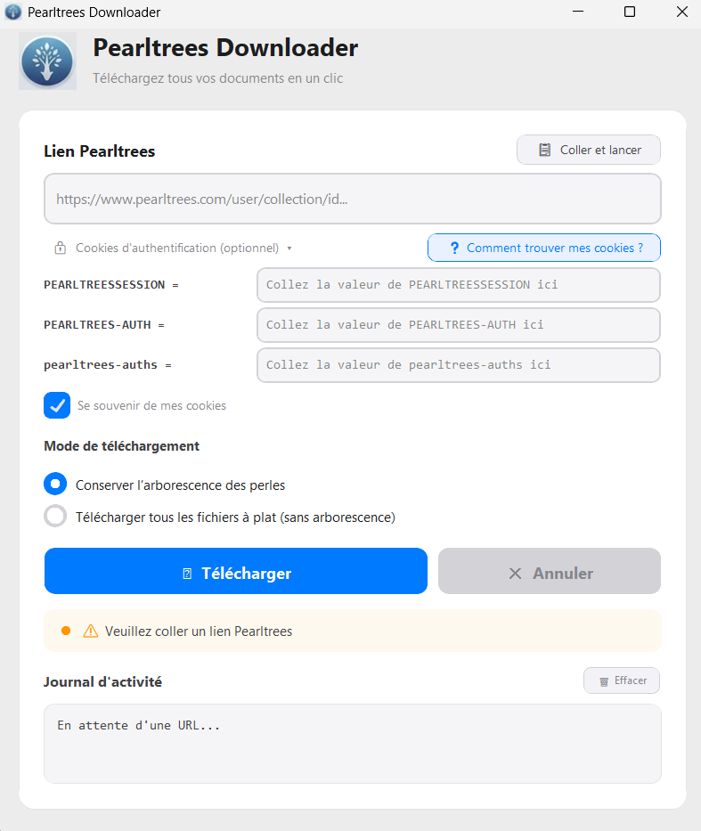

# pearltrees-scrapper
🌳 Pearltrees Downloader 

Pearltrees Downloader est un outil de bureau moderne et performant conçu pour télécharger l'intégralité de vos collections Pearltrees (fichiers, PDF, images, vidéos) en un seul clic.

# ✨ Caractéristiques

- 🚀 Téléchargement récursif : Récupère automatiquement tous les fichiers des sous-collections.

- 💎 Design Premium : Interface inspirée de macOS avec verre dépoli, ombres douces et animations fluides.

- 🔒 Support des Collections Privées : Système d'authentification par cookies pour accéder à vos perles privées en toute sécurité.

- 📂 Organisation flexible : Conservez l'arborescence originale des dossiers Pearltrees ou téléchargez tous les fichiers à plat dans un seul dossier !

- 📝 Export de structure : Générez automatiquement un fichier `.txt` avec l'arborescence d'origine (pratique en mode à plat).

- ⚡ Haute Performance : Moteur de téléchargement optimisé avec journal d'activité en temps réel.

# 🚀 Installation & Utilisation :

- Rendez-vous dans l'onglet Releases.

- Téléchargez le fichier "PearltreesDownloader.exe"

- Lancez l'application (aucune installation requise).

- Collez l'URL de votre collection Pearltrees et cliquez sur Télécharger.

- 🔑 Comment télécharger des collections privées ?

- Pour les collections qui ne sont pas publiques, l'application a besoin de vos cookies d'authentification :

- Connectez-vous sur Pearltrees.com dans votre navigateur.

- Ouvrez les outils de développement (F12).

- Allez dans l'onglet Réseau (Network) et actualisez la page.

- Cherchez la ligne Cookie: et copiez les valeurs de PEARLTREESSESSION, PEARLTREES-AUTH, et pearltrees-auths.

- Collez-les dans les champs "Optionnel" de l'application.

# 🛡️ Confidentialité & Sécurité

- Aucun stockage externe : Vos cookies ne sont jamais envoyés à un serveur tiers. Ils sont utilisés uniquement pour communiquer avec l'API officielle de Pearltrees.

- Open Source : Le code est transparent et vérifiable par tous.
Zéro trace : L'exécutable est autonome et ne laisse aucune trace système.

# 🛠️ Technologies

- Python 3.13

- CustomTkinter (UI moderne)

- Requests (Moteur réseau)

- PyInstaller (Bundle exécutable)

- Ce projet est distribué sous licence MIT. N'hésitez pas à ouvrir une "Issue" pour toute suggestion !
