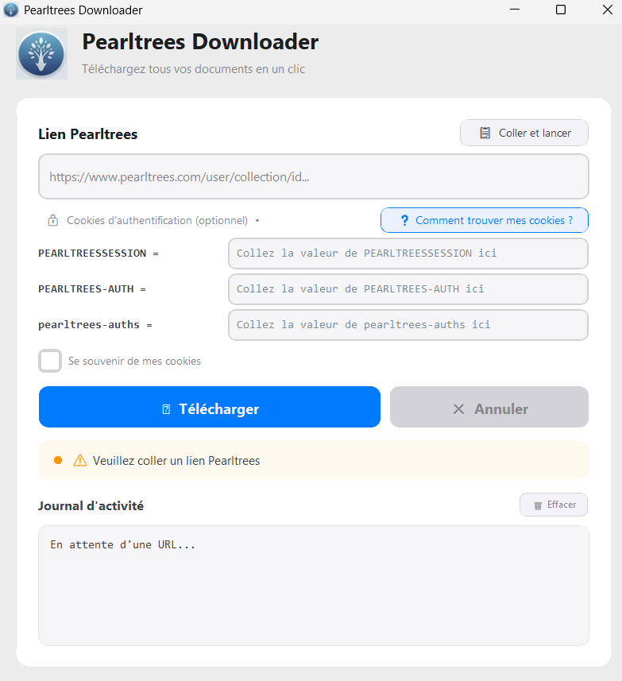

# pearltrees-scrapper

🌳 **Pearltrees Downloader**

Pearltrees Downloader est un outil de bureau moderne et performant conçu pour télécharger l'intégralité de vos collections Pearltrees (fichiers, PDF, images, vidéos) en un seul clic, tout en conservant l'arborescence de vos dossiers.

---

## ✨ Caractéristiques

- 🚀 **Téléchargement récursif** : récupère automatiquement tous les fichiers des sous-collections.
- 💎 **Design Premium** : interface inspirée de macOS avec verre dépoli, ombres douces et animations fluides.
- 🔒 **Support des collections privées** : système d'authentification par cookies pour accéder à vos perles privées en toute sécurité.
- 📂 **Organisation automatique** : recrée la structure de dossiers de Pearltrees sur votre ordinateur.
- ⚡ **Haute performance** : moteur de téléchargement optimisé avec journal d'activité en temps réel.
  

---

## 🚀 Installation & Utilisation

1. Rendez-vous dans l'onglet **Releases**.
2. Téléchargez le fichier **`PearltreesDownloader.exe`**.
3. Lancez l'application *(aucune installation requise)*.
4. Collez l'URL de votre collection Pearltrees.
5. Cliquez sur **Télécharger**.

---

## 🔑 Comment télécharger des collections privées ?

Pour les collections qui ne sont pas publiques, l'application a besoin de vos cookies d'authentification :

1. Connectez-vous sur **Pearltrees.com** dans votre navigateur.
2. Ouvrez les outils de développement avec **F12**.
3. Allez dans l'onglet **Réseau** (*Network*) et actualisez la page.
4. Cherchez la ligne `Cookie:`.
5. Copiez les valeurs de :
   - `PEARLTREESSESSION`
   - `PEARLTREES-AUTH`
   - `pearltrees-auths`
6. Collez-les dans les champs **"Optionnel"** de l'application.

---

## 🛡️ Confidentialité & Sécurité

- **Aucun stockage externe** : vos cookies ne sont jamais envoyés à un serveur tiers. Ils sont utilisés uniquement pour communiquer avec l'API officielle de Pearltrees.
- **Open Source** : le code est transparent et vérifiable par tous.
- **Zéro trace** : l'exécutable est autonome et ne laisse aucune trace système.

---

## 🛠️ Technologies

- **Python 3.13**
- **CustomTkinter** *(UI moderne)*
- **Requests** *(moteur réseau)*
- **PyInstaller** *(bundle exécutable)*

---

## 📄 Licence

Ce projet est distribué sous licence **MIT**.

N'hésitez pas à ouvrir une **Issue** pour toute suggestion ou amélioration.
